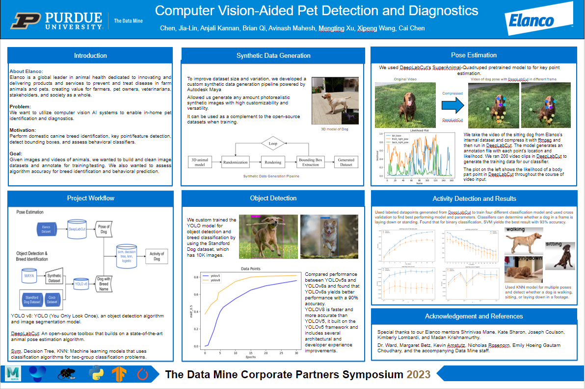
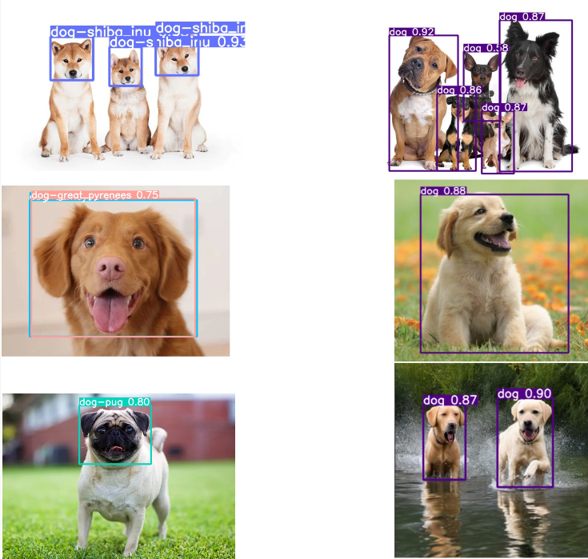

Our goal for this project is to utilize computer vision AI systems to enable in-home pet identification and diagnostics.

Specific Aims:

<pre>
- Build and clean image datasets and annotate for training/testing
- Run automated workflow for processing images on cluster to create dataframe for analytics
- Perform domestic canine breed identification, key point/feature detection, detect bounding boxes, and assess behavioral classifiers
- Visualize data by different factors
- Assess algorithm accuracy for breed identification and behavioral prediction

Three Categories of the Project

<b>Object Detection and Breed Identification</b>
- We used the computer technology related to computer vision technique. For all the pictures for training the objects have bounding box around them, we used yolov5 to train models. We then optimized performance by adjusting number of epochs, batch size, and image augmentation parameters, and also compared performance for Yolov5 and Yolov8.

<b>Synthetic Data Generation</b>
- In order to improve dataset size and variation, we implemented a synthetic data generation pipeline using Autodesk Maya and allowed us generate any amount photorealistic synthetic images with high randomization and expandability. 

<b>Pose Estimation</b>
- We used DeepLabCut to get keypoints detected for different animals. It can detect the joints in a picture or video.

</pre>

Source: <a href="https://github.com/jogarces/ics-313-text-game"><i class="large github icon "></i>jogarces/ics-313-text-game</a>
