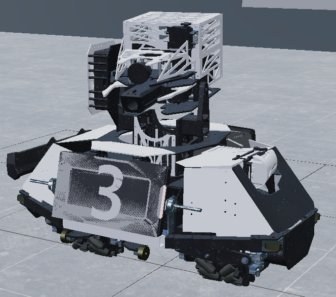

<div class="text-center p-4">
  
  
</div>

Our goal for this project is to augmented Robomaster's datasets in order to get a larger datasets for traning, and also generate  synthetic datasets for different angle of the robots by changing camera angles in Maya application. This is a year long project

Our team expand the existing datasets in order to improve the accuracy and train the datasets in different methods in order to achieve it. The method we used including scaling, rotation, position, and brightness.

In order to improve dataset size and variation, we implemented a synthetic data generation pipeline using Autodesk Maya and allowed us generate any amount photorealistic synthetic images with high randomization and expandability. Synthetic data generation offers a solution by allowing the extraction of large amounts of images and metadata directly from a virtual environment, while maintaining precise ground truth annotations.

Here is some code that illustrates how we read values from the line sensors:

```cpp
byte ADCRead(byte ch)
{
    word value;
    ADC1SC1 = ch;
    while (ADC1SC1_COCO != 1)
    {   // wait until ADC conversion is completed   
    }
    return ADC1RL;  // lower 8-bit value out of 10-bit data from the ADC
}
```
